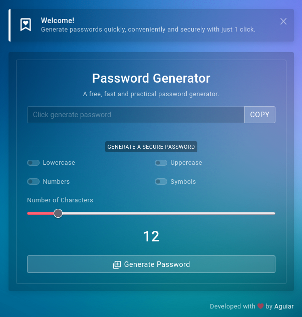

# Password Generator
This project is a fast, practical and free password generator.

In addition to being a fully customizable project, with open source, it is fully mobile responsive.

<center>
    
</center>

## Theme
This project was built with the help of Codervent, who provided the beautiful frontend for building this project.
- Buy this theme: https://themeforest.net/item/dashtreme-multipurpose-bootstrap4-admin-template/23059455

## Libraries
Despite many studies, articles read on forums and searches on large platforms (such as W3 Schools), I only used 3 libraries to build this password generator.

- EJS
- Express
- Socketio

### EJS 
EJS is a template engine capable of generating a new HTML document on every page reload with the elements that the backend provides.

### Express
EXPRESS was used to build the entire backend and server structure.

### Socketio
Socket.io was used to facilitate real-time communication from the backend to the frontend.

# Installing and Using
This project is opensource and is protected by the MIT License.

To use this project, you just need to clone this repository in a directory of your choice.

```
git clone https://github.com/aguiar-us/password-generator
```

Then you will go to the app folder of the application.

```
cd password-generator/app/
```

Here you will install the project dependencies.

```
npm install
```

Now you just need to open the server, you can do it by an npm script that I already predefined or manually.

## Manually
```
node source/server.js
```

## NPM Script

### Development

```
npm run development
```

### Production

```
npm run production
```

#### References:
- https://www.w3schools.com/howto/howto_js_copy_clipboard.asp
- https://dev.to/code_mystery/random-password-generator-using-javascript-6a
- https://socket.io/docs/v4/
- https://socket.io/get-started/chat